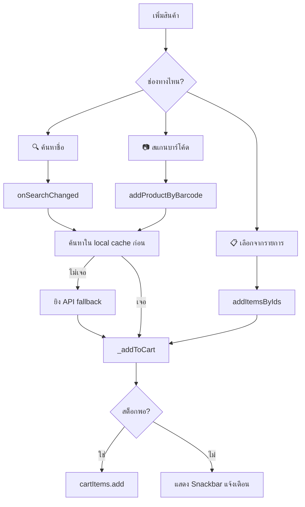
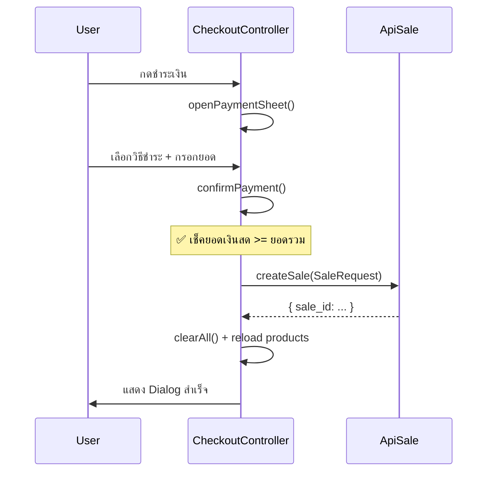
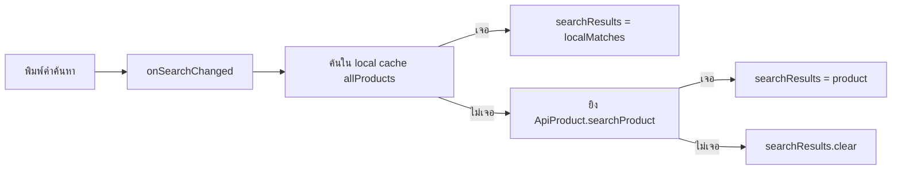
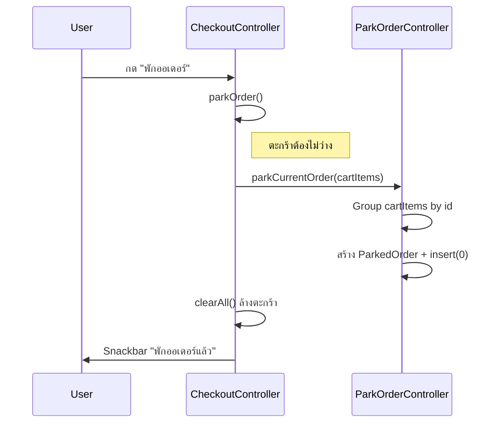
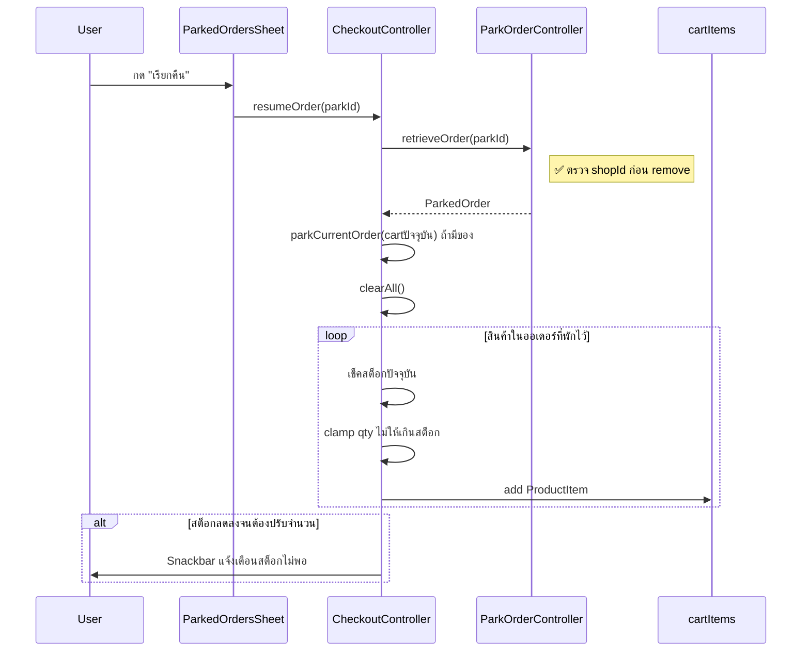

# 🛒 การทำงานของตะกร้าและพักออเดอร์ — EazyStore

## 📦 Library ที่ใช้

| Library | Version | ใช้ทำอะไร |
|---|---|---|
| **GetX** (`get: ^4.7.3`) | 4.7.3 | State Management, Navigation, Dependency Injection |
| **shared_preferences** | ^2.5.4 | เก็บ `shopId`, `username` ใน local storage |
| **mobile_scanner** | ^7.1.3 | สแกนบาร์โค้ด |
| **intl** | ^0.20.2 | Format ราคาเงิน เช่น `#,##0.##` |
| **flutter_slidable** | ^4.0.3 | UI slide-to-delete บนรายการ |

---

## 🏗️ สถาปัตยกรรม (Architecture)

```
CheckoutController (GetX Controller)
    ├── cartItems: List<ProductItem>   ← ตะกร้าสินค้า (Reactive)
    ├── allProducts: List<ProductResponse>   ← คลังสินค้าในเครื่อง
    ├── searchResults: List<ProductResponse>  ← ผลค้นหา
    └── ParkOrderController (Singleton permanent)
            └── parkedOrders: List<ParkedOrder>  ← ออเดอร์ที่พักไว้
```

> [!NOTE]
> `ParkOrderController` ถูก register แบบ **`permanent: true`** ใน `main.dart`
> ทำให้มีชีวิตอยู่ตลอดแม้จะสลับร้านค้า และใช้ `shopId` แยกออเดอร์ของแต่ละร้าน

---

## 🛒 ตะกร้าสินค้า (Cart Logic)

### Data Model — `ProductItem`
```dart
class ProductItem {
  final String id;       // productId
  final String name;
  final double price;    // ราคาต่อชิ้น
  final String category;
  final String imagePath;
  final int maxStock;    // สต็อกสูงสุด (snapshot ตอนหยิบ)
  final String unit;     // หน่วย เช่น "ชิ้น", "กก."
  RxBool showDelete;     // คุม UI ปุ่มลบ
}
```

> [!IMPORTANT]
> ตะกร้าใช้รูปแบบ **"1 ชิ้น = 1 object"** แทนการเก็บ quantity ใน object เดียว
> เช่น ถ้ามีน้ำ 3 ขวด = มี `ProductItem` 3 ตัวที่มี id เดียวกันใน list

### วิธีเพิ่มสินค้าเข้าตะกร้า (3 ช่องทาง)



### ปรับจำนวนสินค้า

| ฟังก์ชัน | การทำงาน |
|---|---|
| `increaseItem()` | เพิ่ม 1 ชิ้น → add ProductItem ใหม่เข้า list |
| `decreaseItem()` | ลด 1 ชิ้น → remove ตัวสุดท้ายที่ id ตรงกัน |
| `setItemQuantity()` | ตั้งจำนวนตรงๆ → add/remove หลายตัวพร้อมกัน |
| `removeItem()` | ลบทุกชิ้นที่ id ตรง |
| `clearAll()` | ล้างตะกร้าทั้งหมด |

### การตรวจสอบสต็อก

```dart
// ใช้สต็อก "ปัจจุบัน" จาก allProducts (refresh แล้ว)
// ไม่ใช่ snapshot เก่าที่ติดมากับตะกร้า
int _currentMaxStock(ProductItem item) {
  final match = allProducts.firstWhereOrNull(...);
  return match?.stock ?? item.maxStock;
}
```

---

## 💰 การชำระเงิน (Payment Flow)



### วิธีชำระเงิน
- **จ่ายเงินสด** — ต้องกรอกยอดรับมา ≥ ยอดรวม, คำนวณเงินทอน
- **โอนจ่าย** — ส่ง `pay = totalPrice` ไปตรงๆ ไม่ต้องกรอกยอด
- **ลูกหนี้ (Debt Mode)** — ส่งไปกับ `debtorId`

### SaleRequest ที่ส่ง API
```dart
{
  "shop_id": 1,
  "debtor_id": null,
  "net_price": 150.50,
  "pay": 200.00,
  "payment_method": "จ่ายเงินสด",
  "note": "...",
  "created_buy": "username",
  "sale_items": [
    { "product_id": 5, "amount": 2, "price_per_unit": 50.0, "total_price": 100.0 }
  ]
}
```

> [!NOTE]
> ตะกร้ามี ProductItem ซ้ำหลายตัว ตอนส่ง API จะ **group by productId** ก่อน
> แล้วคำนวณ `price_per_unit = totalPrice / amount` เผื่อราคาเปลี่ยนกลางทาง

---

## 🔍 ระบบค้นหาสินค้า (Search Logic)



> [!IMPORTANT]
> มีการป้องกัน **Race Condition** ด้วย `_searchRequestId`
> ถ้าพิมพ์เร็วๆ แล้ว request เก่ากลับมาช้ากว่า request ใหม่
> ผลเก่าจะถูกทิ้งไม่ให้ทับผลใหม่

---

## ⏸️ พักออเดอร์ (Park Order)

### Data Model
```dart
class ParkedOrder {
  String id;        // "park_<timestamp>"
  String label;     // "ออเดอร์ 1", "ออเดอร์ 2"
  List<ParkedItem> items;  // รายการสินค้า (grouped by id)
  double totalPrice;
  DateTime parkedAt;
  int shopId;       // ผูกกับร้านค้า
}
```

### Flow การพักออเดอร์



### Flow การเรียกคืนออเดอร์



### ระบบ Multi-shop Isolation

```dart
// กรอง visible orders ด้วย shopId
List<ParkedOrder> get visibleOrders =>
    parkedOrders.where((o) => o.shopId == currentShopId.value).toList();

// retrieve ก็กรอง shopId เสมอ
ParkedOrder? retrieveOrder(String parkId) {
  final index = parkedOrders.indexWhere(
    (o) => o.id == parkId && o.shopId == currentShopId.value,
  );
  ...
}
```

> [!WARNING]
> ออเดอร์ที่พักไว้ **เก็บเฉพาะใน RAM** ไม่ได้ persist ลง storage
> ถ้าปิดแอปจะหายหมด

---

## 📂 ไฟล์สำคัญ

| ไฟล์ | หน้าที่ |
|---|---|
| [checkout_controller.dart](file:///z:/eazy_store/lib/page/sale_producct/sale/checkout_controller.dart) | Controller หลักของตะกร้า + ชำระเงิน |
| [park_order_controller.dart](file:///z:/eazy_store/lib/page/sale_producct/sale/park_order_controller.dart) | Controller จัดการพักออเดอร์ |
| [parked_orders_sheet.dart](file:///z:/eazy_store/lib/page/sale_producct/sale/parked_orders_sheet.dart) | UI Bottom Sheet แสดงออเดอร์ที่พักไว้ |
| [baskets_model.dart](file:///z:/eazy_store/lib/model/request/baskets_model.dart) | Model `ProductItem` (1 object = 1 ชิ้น) |
| [parked_order_model.dart](file:///z:/eazy_store/lib/model/request/parked_order_model.dart) | Model `ParkedOrder` / `ParkedItem` |
| [sales_model_request.dart](file:///z:/eazy_store/lib/model/request/sales_model_request.dart) | Request body ส่ง API บันทึกการขาย |
